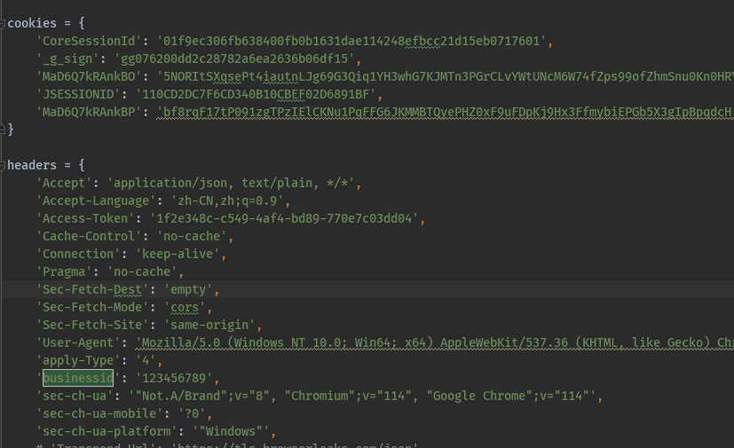
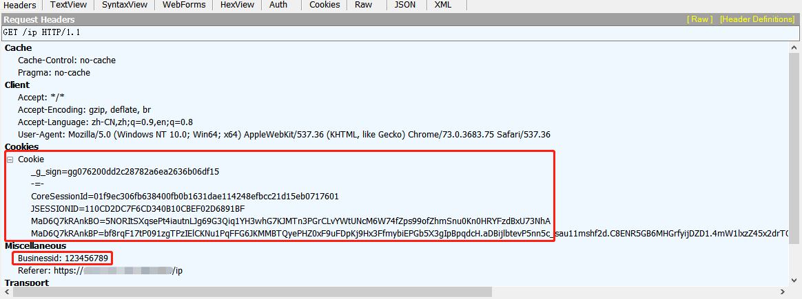
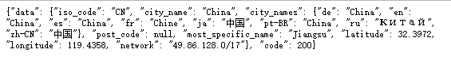
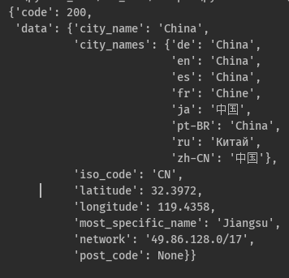
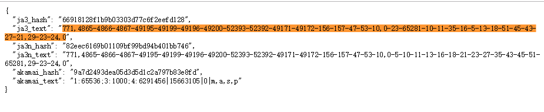
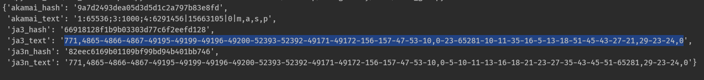
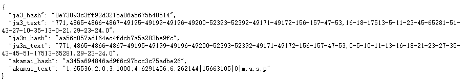
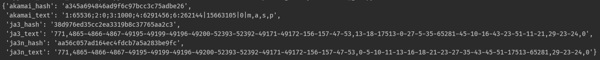

# tls-go-away
让讨厌的tls从此不用在调试代码中考虑

## 使用方法

````
1. pip install websockets loguru requests flask
2. python proxy_server.py
3. 安装SwitchyOmega和tempermonkey
4. 配置完成后进行转发
````

## 详细说明

##### 关于tls指纹检测应该都比较熟悉，本项目提供一种基于浏览器的转发方法，可完全无视tls部分的相关检测（因为我就是用正常浏览器发送的请求）

proxy_server充当了转发中间人，首先当一个请求在需要发送时先在headers中添加`{"Transpond-Url": "https://xxx.xxx.xxx/"`
然后将请求发送给flask的转发路由`/transpond`, 内部将寻找已经连接的浏览器并进行转发，浏览器收到请求后使用XmlHttpRequest向目标网址发送请求,
所得的结果将原路返回。如果需要配置动态代理则可以参考`https://mp.weixin.qq.com/s/BPKtIJBqSEOacwm-byzXKg`.感谢大姐大的无私奉献

## 暂未处理事项

XmlHttpRequest的跨域问题。因此需要浏览器先在地址栏输入目标网址进入后才可进行转发<br>
websockets连接异常<br>
浏览器卡死自动重启<br>
多网址多浏览器集中后的处理逻辑<br>


## 实例

1.添加某个header或cookie, 需要在tempermonkey_js.js中添加逻辑，此处把header中一个特殊字段和cookie最终都添加进了请求中，
抓包工具可以看的很清楚
<br>



2.查看ip是否被SwitchyOmega代理上，最终在浏览器上显示的和使用requests转发获得的结果都是相同的，同为我此刻一个代理的地址<br>
<br>


##### 以上两个案例的网址来自某还不想公布的大佬, 暂无法提供测试网址, 想仅测试ip可使用`http://httpbin.org/ip`


3.查看tls, 以老chrome和新chrome对`https://tls.browserleaks.com/json`测试。<br>
chrome73版本：ja3和ja3n，转发的请求都与浏览器请求的完全一样
<br>
<br>

再看chrome114版本：ja3n转发的请求都与浏览器请求的完全一样, 但ja3并不一样。
这是因为新版chrome随机了一些拓展套件因此ja3每次都不一样，
而ja3n是对所有的套件进行了排序所取得的结果, 因此新版chrome的ja3每次都不一样，但是仍可通过ja3n判断是否是相同设备<br>
<br>
<br>

